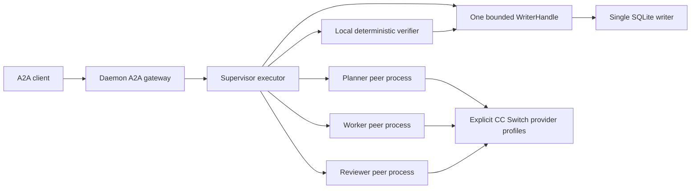

# Stateful A2A and supervisor workflow

This is a local pre-alpha gateway, not a remote deployment or a full coding-harness release. It extends the earlier information-share slice with authenticated Tasks, artifacts, cancellation, subscriptions and a daemon-owned supervisor workflow. [ADR 024](adr/024_stateful_a2a_supervisor.md) records the authority and threat model. `PROGRESS.md` records which paths were actually verified.

## Authority and process topology



The HTTP/JSON-RPC/gRPC adapter maps official SDK types to bounded VibeMux-owned contracts. It receives no SQLite connection. Optional model peers are separate processes with no core writer capability. The daemon owns the task runtime, all peer processes and the writer; normal shutdown stops admission, cancels and joins work, then releases the writer. The model peer reads only the explicitly selected CC Switch profile through a read-only connection. It does not change provider settings or inherit the daemon environment wholesale.

## Versions and transport boundaries

| Component | Contract |
|---|---|
| A2A wire protocol | Released 1.0; interface protocol version `1.0` |
| Official Rust types/client/server | `a2a-lf 0.3.0`, `a2a-client-lf 0.2.1`, `a2a-server-lf 0.4.1` |
| Official gRPC/protobuf boundary | `a2a-grpc 0.3.1`, `a2a-pb 0.2.0` |
| VibeMux task payload | `vibemux.task.request.v1` |
| A2A persistence record | Schema 1, inside SQLite store schema 2 |
| Local daemon/plugin IPC | Existing v2 retained; no plugin Task/Run mutation operation added |

The daemon supervisor serves HTTP+JSON/JSON-RPC and gRPC over the same backend and writer. Its card advertises both owned origins; clients must explicitly allow both. All enabled servers bind numeric loopback addresses on OS-assigned ports. Remote bind, TLS server deployment, signed cards, push delivery and authenticated extended cards are not enabled. HTTP/JSON-RPC `TaskClient` discovery requires an explicit allowlist of every advertised origin, disables redirects and proxy inheritance, and rejects card destinations outside that allowlist. `GrpcTaskClient::connect` instead validates its explicitly supplied numeric loopback endpoint; it does not discover a card or apply the HTTP client origin allowlist. Its caller must select the intended trusted local endpoint, as the daemon does for its owned listener. Merely serving a transport in a test fixture is not a production-readiness claim.

Native A2A messages remain usable by independent SDKs. VibeMux typed clients put a versioned envelope in a DataPart:

```json
{
  "contract": "vibemux.task.request.v1",
  "request": {
    "request_id": "request_1",
    "context_id": "context_1",
    "task_id": null,
    "idempotency_key": "request_1",
    "payload": {"example": "bounded application data"}
  }
}
```

Identifiers are bounded. Payloads are limited to 16 KiB; transport bodies, protobuf messages and SSE buffers are limited to 64 KiB. There are at most 16 artifact parts/artifacts per task snapshot. Task response validation occurs before mapping to wire objects. Artifact URLs are references only and are never fetched automatically.

Each bearer token maps to an explicit subject. Caller-provided identity fields do not grant authority. Subject filtering is applied to get, list, cancel and subscribe; another subject cannot use a known task ID to access or mutate the task. Duplicate keys are scoped to the subject and validated request content. Within one runtime lifetime, duplicate content does not execute again; changed content under the same key fails closed. Numeric identity is canonicalized without modifying the executor input, so `1` and `1.0` do not create a false conflict. Cross-restart inbound request deduplication and recovery are not promised.

## Runtime, streaming and cancellation

The shared task runtime has a 32-request queue, at most 64 retained tasks, at most 8 configured parallel executions, bounded cancellation waiters and subscribers, and a 16-event broadcast buffer per task. The supervisor configures one concurrent workflow; model peers permit two requests. Capacity exhaustion is explicit. Completed entries are retained within the runtime lifetime rather than silently evicted.

Subscriptions start from a coherent current snapshot, then deliver status/artifact updates. Subscriber lag returns an error rather than silently losing events. Disconnecting a subscriber does not cancel the task. Clients reconnect explicitly by getting current state and subscribing again. Send-stream interruption at InputRequired/AuthRequired is distinct from an ongoing subscription. Message history, general interactive follow-up conversations, and automatic replay of in-flight jobs after daemon restart are not implemented. Canonical Run records remain durable; the inbound runtime task index is ephemeral.

Cancellation is a request, not proof of cancellation. The runtime does not relabel an executor's explicit Completed result when cancellation arrives too late. A bound Run records cancellation intent before the remote cancel call. Confirmation requires the observed remote canceled state. If a worker has already completed but the overall workflow is canceled before promotion, the daemon finalizes the local task cancellation only after every related Run has stopped; it retains the worker's Completed observation rather than forging a remote Canceled state.

A panicked executor fails only its identified task; the owner continues to own sibling jobs. Shutdown preserves failure receipts, and deadline expiry aborts and joins outstanding jobs. `Drop` is an emergency cancellation signal, not a verified cleanup receipt. Abrupt daemon termination, remote provider-side generation after disconnect, and descendant process-tree containment are not covered by normal joined-shutdown evidence.

## Canonical binding and verification

Each binding records local Project/Task/Run IDs, peer identity, external task ID, transport, protocol version, UTC timestamps, idempotency, remote state, cancellation state, artifact references and workspace ownership. Internal transport names are `http_json`, `json_rpc` and `grpc`; wire binding strings remain the official SDK values.

SQLite schema 2 adds forward-only A2A storage and command records without rewriting schema-1 events. Updates validate the current stored version and state in the same transaction as the append-only event. Repeated commands must reuse their original IDs, timestamps and content; a conflicting reuse is rejected. Old snapshot-write methods refuse A2A-bound entities so they cannot bypass the new authority gates. `WriterHandle` is non-owning and cannot extend or terminate the writer lifetime.

Remote Completed only records an observation. Canonical Run success and Task completion require a trusted local verification receipt that references:

- a different reviewer Run and peer;
- distinct worktrees/branches with the same task/project/base commit;
- completed worker and reviewer artifacts already bound to their Runs;
- matching worker artifact, review and verifier hashes;
- current optimistic versions and no unrelated live Runs.

Rejected verification preserves the failed worker and negative receipt. Repair creates new Runs and worktrees; it does not edit the prior attempt's history. No automatic stash, reset, clean, commit, merge or push is introduced.

## Worktrees and artifacts

Every writable role Run receives a distinct branch and worktree pinned to the configured full Git commit. A private receipt in that worktree's Git directory binds the run, canonical path, branch, base commit, owner token and Git common directory. Inventory, pointer and receipt checks precede artifact writes and cleanup.

Artifacts are explicit JSON files written with create-new semantics, bounded size and SHA-256 references. Existing files are not overwritten. Cleanup requires a fresh matching owner receipt, Git inventory and a clean worktree, including absence of ignored files; branches are retained. Failed or mismatched cleanup does not use force. These checks are not an OS sandbox or protection against a hostile process running as the same user.

## Supervisor work order

The first supported supervisor recipe is a structured-data artifact workflow. It proves delegation, real model invocation, independent review, verifier authority and persistence without executing model-generated shell commands or code. It is not an unrestricted coding agent or a vendor CLI/harness adapter.

```json
{
  "schema_version": 1,
  "task_description": "Return the unique input integers in ascending order and their sum.",
  "input": [-3, 5, 1, 5, 0, -3, 9],
  "expected_result": {"values": [-3, 0, 1, 5, 9], "sum": 12},
  "max_repairs": 1
}
```

The description is at most 2 KiB; input and expected result are at most 4 KiB each. At most two repair attempts are allowed. The expected result stays in the supervisor/local verifier and is not supplied as the answer to the worker. The reviewer sees the task, input and candidate. Both a positive independent review and an exact local result check are required.

Protobuf Struct represents JSON numbers as floating point. Schema counters accept exact integral numeric values only, including `1.0`; fractional counters are rejected. Structured-result comparison treats `1` and `1.0` as the same JSON number, without epsilon tolerances or clipping. Integer-valued inputs/results must stay within the exact interoperable range `[-(2^53-1), 2^53-1]`.

## Explicit configuration and commands

Build with the committed lockfile. Low build concurrency is recommended on memory-constrained Windows machines:

```text
cargo build --locked --workspace -j 2
```

Use the [configuration template](examples/a2a_supervisor_config.json) and [synthetic work order](examples/a2a_supervisor_work_order.json). Place the completed private configuration outside version control; the template is intentionally invalid until its placeholders are replaced. A private supervisor service JSON contains `supervisor` and `bearer_token`. The supervisor object contains `project_id`, `project_root`, `git_executable`, `base_commit`, `model_peer_executable`, `cc_switch_database`, and the `planner`, `worker`, `reviewer` selections. Each role selection contains `selection: {app_type, provider_id}` and `binding: http_json | json_rpc`. Paths must be explicit absolute paths. Replace the base commit with an actual full commit ID. Generate an unpredictable bearer token of at least 32 allowed characters; do not commit this file or reuse an example token.

The worker and reviewer must use different configured provider identities. Credentials are loaded by the peer from CC Switch, never embedded in the service JSON. The CC Switch inventory/probe executable reads a bounded JSON bootstrap from stdin; its explicit modes do not switch global defaults. Supported configured interfaces are Anthropic Messages and recognized OpenAI-compatible OpenCode profiles. OpenAI-compatible `baseURL` is the complete API root: `/chat/completions` is appended without inserting a new version segment, preserving configured `/v3` and `/v4` roots. The standard `@ai-sdk/openai` Responses API adapter is not silently treated as Chat Completions. OAuth-only, unknown interfaces and unconfigured profiles fail explicitly. Claude context-window suffixes such as `[1M]` are removed only as harness annotations, with both configured and wire model IDs recorded in probe evidence.

Run the built executables from the repository root on Windows; adjust the target path if `CARGO_TARGET_DIR` is set. A Cargo build does not install them into PATH. Start a long-lived daemon with the supervisor enabled:

```text
./target/debug/vibemuxd.exe --project-root <project> --supervisor-config <private_config.json>
```

Default daemon startup still enables neither model peers nor an A2A supervisor. The explicit supervisor startup prints its local HTTP and gRPC gateway addresses without the bearer token. The existing authenticated local IPC remains available for daemon lifecycle.

Run one job through the actual daemon/A2A path and wait for cleanup:

```text
./target/debug/vibemux_supervisor.exe --config <private_config.json> --job <work_order.json>
```

The one-shot runner owns a new daemon and refuses an already-owned project writer; use an A2A client against an existing daemon instead of starting a second writer. The JSON receipt reports the external task, canonical completion, artifact/verification references and whether daemon shutdown was joined. Exit 0 requires verified task completion and successful joined shutdown. Failure receipts are retained separately. A provider HTTP 200, a terminal pane or a peer's Completed state cannot substitute for this receipt.

## Verification boundaries

Official TCK runs use a dedicated deterministic backend implementing the official scenarios; they never invoke providers. Cross-language checks use pinned official Python and Go SDKs in both directions. They are explicitly custom interoperability tests, not a full official ITK run. See [conformance validation](a2a_conformance_validation.md) and the dated progress ledger for exact commands, source/binary hashes, passed/failed/skipped counts and platform scope.

Real provider acceptance is separate from protocol fixtures. Model names in receipts identify requested configured model IDs; they do not attest to a supplier's internal routing or model weights. Native Windows evidence does not establish Linux/WSL, remote/TLS deployment, public plugin SDK stability, live terminal control, arbitrary code execution or production readiness. Quarantine/restart policy for stdio plugins remains independent from A2A task lifecycle and model-request behavior.
